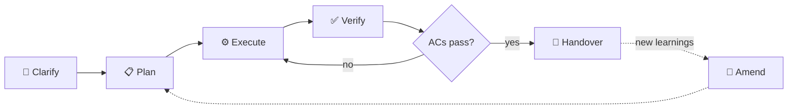

<div align="center">

# 🧱 open-scaffold-omx

**A methodology template for disciplined AI development.**

[](LICENSE)
[](https://github.com/jeanclaudevibedan/open-scaffold-omx/generate)
[](#-recommended-runtimes)
[](#-dogfooded)

</div>

> [!TIP]
> **New here?** Skip straight to [🚀 Quickstart](#-quickstart).
> **Want the why?** Start with [💥 The problem](#-the-problem).

---

## 💥 The problem

Your first session with an AI coding agent goes great. Clean code, clear goals. By session three, you've forgotten what you decided in session one. By session five, the folder structure has grown into something nobody can navigate. Plans exist only in chat history that's long gone. Scope crept in every direction and no one noticed.

This isn't a tooling problem. It's human nature, amplified by multi-agent workflows where every session starts on a blank page. The agent doesn't remember last Tuesday's constraints. You barely do either.

**open-scaffold-omx fixes this by encoding discipline as files.** Mission, plans, amendments, decisions, and handovers all live on disk — checked into git from commit #1 — so any human or agent walking into the repo tomorrow has the full story without asking.

---

## ✨ What you get

| | | |
|---|---|---|
| 🎯 **Mission-first** | `MISSION.md` defines goals and non-goals before a single line is written. Ships unset on purpose — you fill it in on day one. | [→](MISSION.md) |
| 🔒 **Immutable plans** | Plans in `.omx/plans/` (organized in stage subfolders: `active/`, `backlog/`, `done/`, `blocked/`) follow a 7-section schema and become read-only once committed. No silent scope creep. | [→](.omx/plans/handoff-template.md) |
| 📝 **Amendment protocol** | "I got smarter" moments become `<plan>-amendment-<n>.md` files. Run `./amend.sh <plan-slug>` to autonumber, scaffold, and stamp the changelog in one shot. | [→](.omx/plans/README.md) |
| 🧭 **Design choices** | A short page in `docs/decisions/` explains why the scaffold is the way it is — paired views, immutable plans, agent-mediated orchestration. | [→](docs/decisions/README.md) |
| ✅ **`verify.sh` / `osc-omx verify`** | Compliance checks in shell or CLI form. Agents run the quick check before touching code. | [→](verify.sh) |
| 🧰 **`osc-omx` CLI** | OMX adapter CLI. Parses plans, reports status, writes prompt/artifact bundles under `.omx/runs/`, and emits OMX-native handoff commands. | [→](package.json) |
| 🔌 **Adapters** | OMC and OMX live in separate adapter repos. open-scaffold OMX-omx uses `.omx`; OMC uses `.omc`; OMX uses `.omx`. | [→](docs/ADAPTERS.md) |

---

## 🔁 The workflow

Five phases, one per session (or one per feature slice). The amendment loop handles the "I got smarter" case without silent edits.



Each phase maps to a concrete file or command. Full phase-to-tool cheat sheet lives in [docs/WORKFLOW.md](docs/WORKFLOW.md).

---

## 🚀 Quickstart

> [!TIP]
>
> ### 🤖 Let an LLM do it for you
>
> Paste this one-liner into any LLM — coding agent (Claude Code, Cursor, Codex CLI) or chat LLM (ChatGPT, Claude.ai, Gemini web). The agent clones the template, opens [`LLM_QUICKSTART.md`](LLM_QUICKSTART.md) from inside the clone, detects its own capability, and walks you through bootstrap → verify → handoff.
>
> ```text
> Clone https://github.com/jeanclaudevibedan/open-scaffold-omx into a new project directory, then open LLM_QUICKSTART.md from inside the clone and walk me through it.
> ```
>
> **Prefer to drive it yourself?** The manual steps below do the same thing by hand. ⬇️

---

### 1. Create your project from the template

```bash
gh repo create <your-project> --template jeanclaudevibedan/open-scaffold-omx --clone
cd <your-project>
```

Or hit the green **Use this template** button on GitHub.

### 2. Run bootstrap

```bash
./bootstrap.sh
```

Bootstrap asks three questions and writes your answers into `MISSION.md`:

- **What is this project?** — one sentence
- **What should it achieve?** — main outcomes (separate multiple with semicolons)
- **What should this project NOT do?** — adjacent features explicitly out of scope (separate multiple with semicolons)

That's the mission. Everything downstream traces back to it.

### 3. Write your first plan

If your goal is clear, tell your agent:

> *"Write a plan in `.omx/plans/active/` for \<your task\> using the handoff template."*

If your goal is fuzzy, let the agent interview you into clarity first:

```bash
# With oh-my-claudecode installed:
/deep-interview
```

Without OMC, ask any agent: *"Interview me until you understand exactly what to build, then write a plan in `.omx/plans/active/` using `.omx/plans/handoff-template.md`."*

**Fully manual fallback:**

```bash
cp .omx/plans/handoff-template.md .omx/plans/active/my-first-task.md
$EDITOR .omx/plans/my-first-task.md
```

Either way you end up with a plan file: Context, Goal, Constraints, Files to touch, Acceptance criteria, Verification steps, Open questions.

### 4. Check compliance (optional but satisfying)

```bash
./verify.sh
```

Exit code 0 means your mission is defined, a plan exists, amendments are sequential, and the methodology is intact. Pair it with `--strict` once you have plans shipping.

---

## 🧩 Scaffold vs. runtime

> A runtime without a scaffold is a powerful engine with no chassis. You drive fast, but parts fall off along the way.

| | **Scaffold** (what open-scaffold-omx is) | **Runtime** (what OMC/OMX are) |
|---|---|---|
| **Defines** | How your project stays organized | How tasks get executed |
| **Lives in** | `MISSION.md`, `.omx/plans/` (with `active/`, `backlog/`, `done/`, `blocked/` subfolders), `docs/decisions/` | Your agent's skills and commands |
| **Persists** | Across every session, agent, and tool | Per session, per invocation |
| **Required?** | Yes — this is the floor | No — scaffold works solo, runtimes amplify it |

open-scaffold-omx is the adapter chassis. `osc-omx` is the mechanic that prepares prompt/artifact bundles and OMX-native handoff commands. Generic open-scaffold stays in `.osc/`; this repo deliberately uses `.omx/` so runtime-specific state and conventions do not leak back into the core.

---

## 🎚️ Works at every tier

The scaffold runs the same way whether you're on the latest orchestration stack or typing everything yourself. What changes is how much work you do by hand.

| Tier | What happens | Delegation |
|---|---|---|
| 🤖 **OMC** ([oh-my-claudecode](https://github.com/yeachan-heo/oh-my-claudecode)) | Agent reads plans, proposes parallel delegation, runs `verify.sh` automatically | Full — `/team`, `/ultrawork`, `/ralph` |
| 🧠 **Plain Claude Code / Cursor / Codex** | Agent reads plans when told to via `CLAUDE.md` / `AGENTS.md` | Agent describes parallelism; you dispatch |
| ⌨️ **Local LLM or no agent at all** | You read the plans. The methodology still works. | Run `./delegate.sh <plan>` for copy-pasteable prompts |

Higher tiers automate more. Lower tiers keep every file and protocol intact.

---

## 🛠️ Recommended runtimes

- **[oh-my-claudecode (OMC)](https://github.com/yeachan-heo/oh-my-claudecode)** — multi-agent orchestration for Claude Code. Planning, parallel execution, verification, consensus loops. The heavy-lift runtime.
- **[oh-my-codex (OMX)](https://github.com/Yeachan-Heo/oh-my-codex)** — same philosophy for Codex CLI. The fast-typing cockpit — boilerplate, single-file edits, throughput over judgment.

Neither is required. Use Cursor, Windsurf, Aider, or a plain terminal — the scaffold is just markdown and bash.

---

## 🤔 Questions you're probably asking

Not an FAQ. These are the questions that matter most. For the full list, see [docs/FAQ.md](docs/FAQ.md).

<details>
<summary><b>So, does this allow multi-agent automatic orchestration?</b></summary>

> Not by itself. The scaffold is paperwork; orchestration is the runtime's job. What it *does* is give an agent a machine-readable structure to act on: an OMC-equipped Claude reads your plan's Execution Strategy section, parses the parallel groups, and dispatches them into `/team` or `/ultrawork` itself. Without a runtime, `./delegate.sh <plan>` emits terminal prompts you paste into separate sessions. The scaffold enables orchestration. It doesn't perform it.

</details>

<details>
<summary><b>Does this make my agent smarter, or just more disciplined?</b></summary>

> Disciplined. Smarter is the model's job. What changes is that your agent stops forgetting, stops drifting, and stops making the same class of mistake twice — because the constraints are written down where it can re-read them next session.

</details>

<details>
<summary><b>What's the difference between this and any other framework out there?</b></summary>

> Most "AI dev frameworks" are orchestration runtimes — they're engines. This is the chassis. It treats the problem as **persistence of intent across sessions**, not automation of a single session. The [amendment protocol](.omx/plans/README.md), the immutability rule, the [paired CLAUDE.md/AGENTS.md views](docs/decisions/README.md) — boring methodology pieces nobody else ships because they're not glamorous. They're also the ones that actually matter six weeks in.

</details>

<details>
<summary><b>Why can't I just edit the plan when something changes?</b></summary>

> Because edits silently rewrite history. The amendment protocol is the trade: run `./amend.sh <plan-slug>` — it drops a fresh `<plan>-amendment-<n>.md` next to the plan, scaffolds the 5-section schema, and stamps MISSION.md's changelog. The original plan stays frozen. Slower in the moment, honest forever after. ([How amendments work](.omx/plans/README.md))

</details>

<details>
<summary><b>Do I need Claude Code or OMC to use this?</b></summary>

> No. The core layer is markdown files and bash scripts. It works with any agent, any editor, or a human typing by hand. OMC and OMX are force-multipliers, not prerequisites.

</details>

<details>
<summary><b>Does this work with Cursor / Codex / Aider / local LLMs?</b></summary>

> Yes to all. Cursor and Aider read [CLAUDE.md](CLAUDE.md) naturally. Codex reads [AGENTS.md](AGENTS.md). Local LLMs usually need you to paste context manually, but the methodology doesn't care — the plan files are for *you* as much as for the agent.

</details>

<details>
<summary><b>Isn't this over-engineering for a solo side project?</b></summary>

> If your side project dies in one session, yes. If it survives to session ten and you've forgotten half the decisions from session two — which is what usually happens — then no, it's the cheapest possible fix. The whole scaffold is 11 files. You can follow it by hand in 15 minutes a week.

</details>

<details>
<summary><b>When does this actively <i>not</i> help?</b></summary>

> Single-session throwaway scripts. One-off bug fixes. Prototypes you'll delete in an hour. Anything where the "drift across sessions" pain doesn't exist. Using open-scaffold-omx for those is like writing a PRD for a grocery list.

</details>

---

## 📁 What's inside

<details>
<summary><b>File map</b></summary>

| File | Purpose |
|---|---|
| [`MISSION.md`](MISSION.md) | Source of truth for what the project is. Ships with an `<!-- mission:unset -->` marker. |
| [`CLAUDE.md`](CLAUDE.md) | Claude Code's entry point. Agents read this first. |
| [`AGENTS.md`](AGENTS.md) | Entry point for Codex, Gemini, and other agents (paired view of `CLAUDE.md`). |
| [`.omx/plans/handoff-template.md`](.omx/plans/handoff-template.md) | The 7-section schema every plan file follows. |
| [`.omx/plans/README.md`](.omx/plans/README.md) | Amendment protocol in under 200 words. |
| [`docs/decisions/`](docs/decisions/) | ADR index, template, and two ships-as-examples. |
| [`docs/WORKFLOW.md`](docs/WORKFLOW.md) | Phase-to-tool cheat sheet. Clarify → Plan → Execute → Verify → Amend. |
| [`bootstrap.sh`](bootstrap.sh) | Day-one interactive setup. Idempotent. |
| [`verify.sh`](verify.sh) | Compliance checker. `--quick`, `--standard`, `--strict`. |
| [`delegate.sh`](delegate.sh) | Parallel-group prompt generator for non-agent users. |
| [`amend.sh`](amend.sh) | Amendment scaffolder. Autonumbers the next amendment, scaffolds the 5-section schema, and stamps MISSION.md's changelog. |
| [`close.sh`](close.sh) | Plan closer. Moves a completed plan and its amendments to `done/` and stamps MISSION.md's changelog. |
| [`.omx/RULES.md`](.omx/RULES.md) | Compact non-negotiable principles. Re-read before any major action on project structure. |
| [`.omx/plans/WORKFLOW.md`](.omx/plans/WORKFLOW.md) | Stage-based plan workflow rules. Defines how plans move between `active/`, `backlog/`, `done/`, and `blocked/`. |

</details>

<details>
<summary><b>Glossary</b></summary>

**AC (Acceptance Criterion)** — A testable yes/no statement that defines "done." Every plan file has them. If they pass, the work is done. If they don't, it isn't.

**ADR (Architecture Decision Record)** — A short note explaining *why* a decision was made, not just *what*. Lives in `docs/decisions/`. Future-you (and future-agents) will thank present-you.

**Amendment Protocol** — The rule that plan files are immutable once committed. New learnings become `<slug>-amendment-<n>.md` files (in the same stage folder as the parent plan — `active/`, `backlog/`, `done/`, or `blocked/`) instead of silent edits. Scaffolded by `./amend.sh <plan-slug>`. Full rules in [`.omx/plans/README.md`](.omx/plans/README.md).

**Amend** — `./amend.sh <plan-slug>`. Autonumbers the next amendment file, scaffolds the 5-section schema, and stamps MISSION.md's changelog. Use `--backlog` to place the amendment in `backlog/` instead of `active/`. Use this instead of hand-writing amendment files.

**Close** — `./close.sh <plan-slug>`. Moves a completed plan and its amendments from their current stage folder to `done/` and stamps MISSION.md's changelog. Use this when all acceptance criteria pass.

**Bootstrap** — `./bootstrap.sh`. Interactive, idempotent, optional. Walks you through defining your mission on day one.

**Delegate** — `./delegate.sh <plan>`. Reads a plan's Execution Strategy section and prints prompts you can paste into parallel terminal sessions. Designed for users without an orchestration runtime.

**OMC / OMX** — [oh-my-claudecode](https://github.com/yeachan-heo/oh-my-claudecode) and [oh-my-codex](https://github.com/Yeachan-Heo/oh-my-codex). Recommended runtimes, not required.

**Plan Immutability** — Once a plan is committed to git, it is never edited. Changes layer on top as amendments. This is the single rule that prevents silent scope creep.

**Scaffold** — The project-specific structure that organizes plans, decisions, amendments, and handovers in your repo. open-scaffold-omx is a scaffold. OMC and OMX are runtimes.

**Session Handover** — The practice of producing explicit, reviewable deliverables at the end of each work session so the next session (human or agent) starts with context, not questions. See [`docs/WORKFLOW.md`](docs/WORKFLOW.md).

**verify.sh** — The built-in compliance checker. `--quick` (what agents run automatically), `--standard` (the default), `--strict` (full methodology audit).

</details>

<details>
<summary><b>Under the hood</b></summary>

open-scaffold-omx has two layers:

- **Core methodology** — folder discipline, immutable plans, amendment protocol, ADRs, session handover, and the `osc-omx` prompt/artifact CLI. Framework-agnostic. Works with any agent or no agent at all.
- **Adapter-enhanced layer** — separate OMC/OMX adapter repos that read the `.omx` contract and automate runtime-specific workflows. OMC maps to `.omc`; OMX maps to `.omx`.

The scaffold is the load-bearing part. The runtimes amplify it. You can strip the runtimes away and the methodology still holds.

</details>

---

## 🐕 Dogfooded

open-scaffold-omx was built using open-scaffold-omx.

---

## 📜 License

[MIT](LICENSE). Fork it, ship it, rip it apart. Just don't forget to define your mission first.
